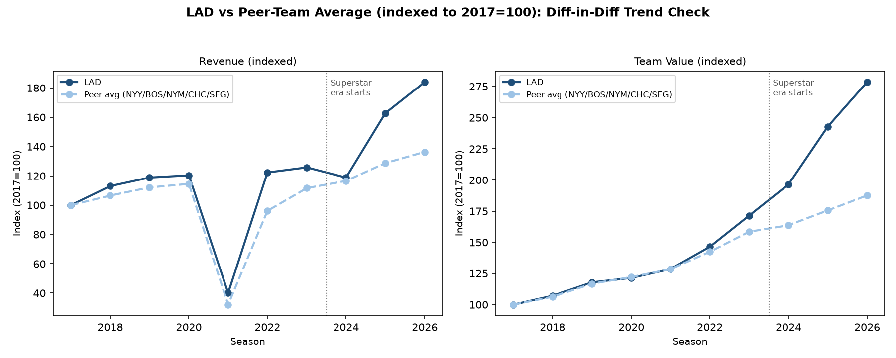

# Dodgers Pitching Analytics

**Do harder-throwing pitchers create enough performance value to justify greater injury risk?** This project studies 221 Los Angeles Dodgers pitcher-seasons and a six-team financial panel using Python, Excel, Tableau, and exploratory econometrics.

> **한국어 요약:** LA 다저스 투수의 구속, 부상일수, WAR 효율 간의 관계와 2024년 이후 구단 재무 변화를 분석한 데이터 분석 포트폴리오입니다. 구속은 부상 위험과 정규시즌 효율 모두와 양(+)의 관계를 보였지만, 관찰자료이므로 인과관계로 단정하지 않습니다. 2026년 재무 수치는 시즌 진행 중 잠정 추정치입니다.



*Representative analysis figure: LAD and peer-team revenue/value trends used to inspect the DiD design. This is not a screenshot of the full Tableau dashboard.*

## Executive findings

The main regression sample contains **184 pitcher-season observations from 106 unique pitchers** after excluding 37 observations below five innings.

| Question | Estimate | Interpretation |
| --- | ---: | --- |
| Fastball velocity and IL days | **+4.24 days per 1 mph** (`p < 0.001`) | Positive observational association after controlling for age and same-season innings; player-clustered standard errors |
| Fastball velocity and WAR/IP | **+0.0015 per 1 mph** (`p < 0.001`) | Higher velocity is associated with greater regular-season value per inning |
| Fastball velocity and postseason proxy | **+0.0080 per 1 mph** (`p = 0.075–0.116`) | Directionally positive, but statistically inconclusive |
| Post-2024 Dodgers revenue, relative to peers | **+$97.4M** (`p < 0.001`) | Exploratory DiD estimate; not a definitive causal effect |
| Post-2024 Dodgers team value, relative to peers | **+$1.655B** (`p < 0.001`) | Exploratory DiD estimate; not a definitive causal effect |
| Post-2024 operating income | **−$2.8M** (`p = 0.955`) | Not distinguishable from zero |

As a workload-control sensitivity check, excluding same-season innings from the IL model
produces a similar estimate: **+4.28 IL days per 1 mph** (`p < 0.001`). This does not remove
all observational confounding, but it shows the result is not driven by that single control.

The descriptive pattern captures the core trade-off: the 96+ mph group had both the highest average IL days and the highest WAR/IP.

| Fastball-velocity bucket | Pitcher-seasons | Mean IL days | Mean WAR/IP |
| --- | ---: | ---: | ---: |
| Below 92 mph | 36 | 21.8 | 0.0086 |
| 92–94 mph | 46 | 21.4 | 0.0083 |
| 94–96 mph | 65 | 26.2 | 0.0089 |
| 96+ mph | 37 | 45.9 | 0.0127 |

These results are **associations, not proof that velocity causes injury, performance, or revenue**. The team-level design has only six team clusters, imperfect pre-treatment parallel trends, a judgment-selected peer group, and estimated rather than audited financials. The 2026 peer-panel values are preliminary, in-season estimates.

## Research design

The project has three connected layers:

1. **Pitcher level:** pooled OLS models relate average fastball velocity to IL days, WAR per inning, and a FIP-based postseason WAR proxy. Standard errors are clustered by player because pitchers can appear in multiple seasons.
2. **Team level:** descriptive pre/post comparisons summarize Dodgers payroll, competitive-balance tax, attendance, postseason games, revenue, operating income, and team value around the 2024 roster-strategy period.
3. **Peer comparison:** a two-way fixed-effects Difference-in-Differences model compares the Dodgers with the Yankees, Red Sox, Mets, Cubs, and Giants from 2017–2026.

Pitcher and simple Dodgers pre/post analyses use 2017–2019 and 2022–2025; 2020–2021 are excluded because the pandemic disrupted season length, attendance, and revenue. The DiD panel retains 2020–2021 because season fixed effects absorb shocks shared by all teams, with a separate robustness specification excluding those years.

See [Methodology](docs/methodology.md), [Limitations](docs/limitations.md), and the [Executive Summary](reports/executive_summary.md) for details.

## Repository structure

```text
.
├── data/
│   ├── raw/                 # retained source exports
│   ├── processed/           # analysis-ready tables
│   └── snapshots/           # archived intermediate outputs
├── dashboard/               # Tableau packaged workbook and preview
├── docs/                    # methods, provenance, dictionary, limitations
├── reports/                 # PDF, Excel, executive summary, and figures
├── scripts/
│   ├── collect/             # API and web-table collection
│   ├── prepare/             # cleaning, merging, and validation
│   ├── analyze/             # regression and DiD analyses
│   └── report/              # chart and report generation
└── tests/                   # automated data and transformation checks
```

## Reproduce the analysis

Python 3.11+ is recommended. Creating a virtual environment keeps dependencies isolated.

```bash
git clone https://github.com/seonghyundanny-gif/dodgers-pitching-analytics.git
cd dodgers-pitching-analytics

python3 -m venv .venv
source .venv/bin/activate
pip install -r requirements.txt
npm ci
```

Install dependencies through the Makefile if you have not already done so:

```bash
make setup
```

The available workflow targets are:

| Target | Purpose |
| --- | --- |
| `make setup` | Install Python, development, and Node dependencies |
| `make data` | Rebuild and validate processed tables from frozen project inputs |
| `make analysis` | Run pitcher models, diagnostics, team comparisons, bridge analysis, and DiD |
| `make report` | Regenerate figures, Excel, DOCX, and PDF outputs |
| `make test` | Run the automated test suite |
| `make reproduce` | Run the complete reproducible workflow in dependency order |

```bash
make data
make analysis
make report
make test
```

To run the complete checked-in workflow in dependency order, use `make reproduce`.

The repository includes processed data so the analysis can be reviewed without repeatedly calling external services. Re-collecting source data may produce revisions or fail because endpoints, page layouts, and access policies change. See [Reproducibility](docs/reproducibility.md) for the exact stages and known gaps.

## Outputs

- [Executive summary](reports/executive_summary.md)
- [Final report (PDF)](reports/final_report.pdf)
- [Analysis workbook](reports/analysis_summary.xlsx)
- [Tableau packaged workbook](dashboard/Dodgers_Pitching_Velocity_Dashboard.twbx)
- [Processed pitcher data](data/processed/pitcher_stats.csv)
- [Processed financial panel](data/processed/comparable_teams_financials.csv)
- [DiD results](data/processed/did_regression_results.csv)

## Data and interpretation notes

- MLB performance, roster, transaction, and schedule data come from MLB Stats API and Baseball Savant/Statcast workflows; regular-season WAR and postseason inputs also use retained FanGraphs exports.
- Payroll and CBT inputs come from Spotrac pages. Financial outcomes are Forbes-style public estimates, not audited club financial statements.
- Page-level source URLs and original access dates for some manually supplied financial estimates were not preserved in the inherited archive. This provenance gap is documented rather than reconstructed from memory.
- `Postseason_WAR_proxy` is a simplified FIP-based approximation, not official FanGraphs WAR.
- `IL_days` is reconstructed from transaction text. Open stints without an activation in the same calendar-year pull are not fully measured.
- The bridge analysis does not support a direct velocity-to-revenue pathway after annualized first differencing.

Full variable definitions are in the [Data Dictionary](docs/data_dictionary.md); source and redistribution notes are in [Data Sources](docs/data_sources.md).

## Limitations and next steps

The highest-priority extensions are to validate IL spells against an authoritative injury dataset, replace same-season innings with prior workload controls, estimate count or hurdle models for zero-heavy IL days, add pitcher fixed-effects or within-player specifications, use wild-cluster bootstrap inference for the six-team DiD, and validate the postseason proxy against an official metric.

This repository is an independent case study and is not affiliated with the Los Angeles Dodgers, MLB, FanGraphs, Spotrac, Forbes, or Tableau. Third-party names and data remain subject to their respective terms.

## License

Code and original documentation are available under the repository [license](LICENSE). Third-party data files are not relicensed by that license; consult [Data Sources](docs/data_sources.md) before redistribution.
